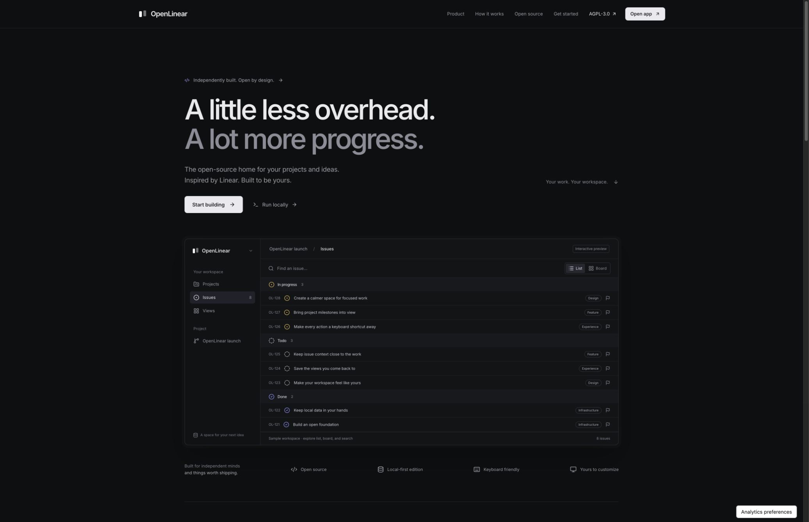
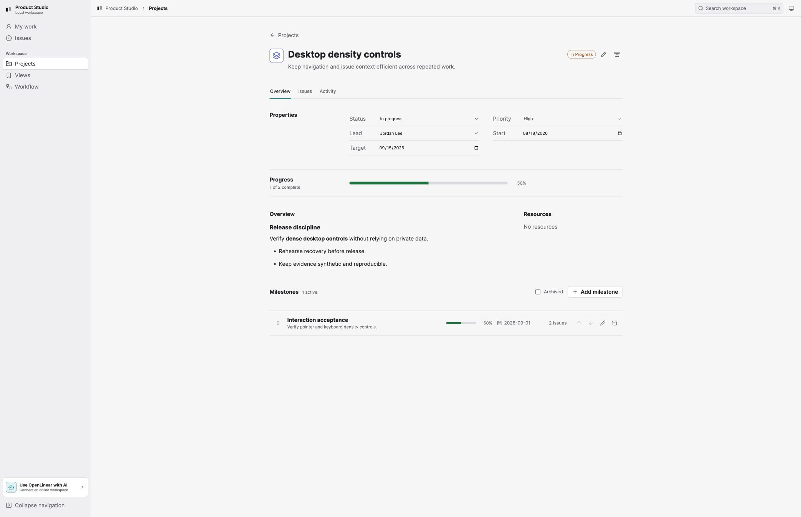
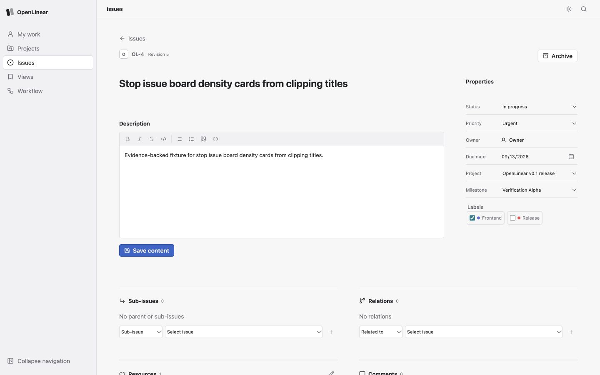
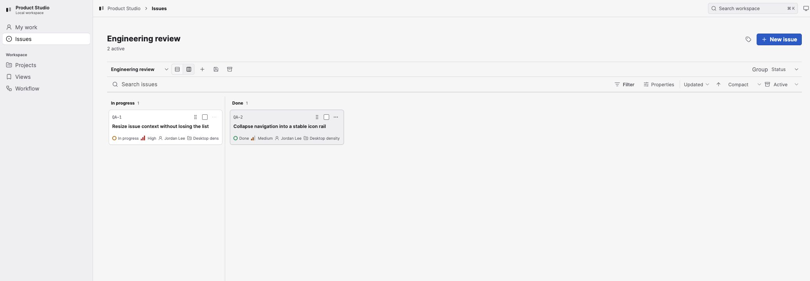
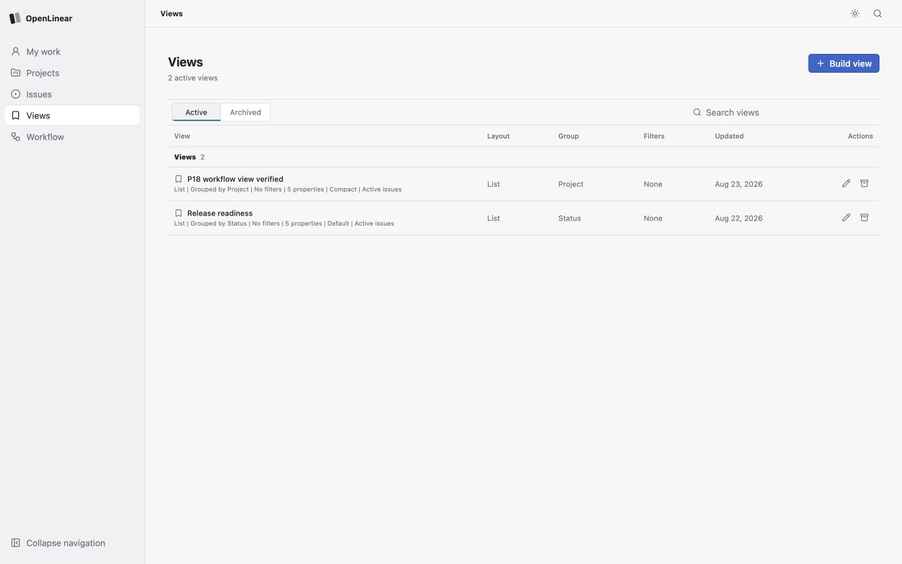
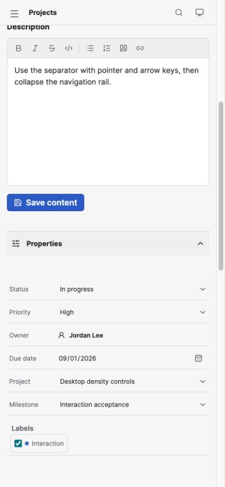

# BasicLinear

BasicLinear is an open-source project management tool for individuals and small
teams. Plan projects, track milestones, organize issues, and review progress
in list or board views. Collaborate in the online app, or run the local edition
with your data in SQLite on your own computer.

**[Open the online app](https://basiclinear.qiaosun.me/?app)** ·
[Website](https://basiclinear.qiaosun.me/) ·
[Run locally](#run-locally) · [Documentation](docs/README.md)

## Choose your workspace

| | Online | Local |
| --- | --- | --- |
| Start | [Open in your browser](https://basiclinear.qiaosun.me/?app) | Build and run with Node.js |
| Sign-in | Google account | No account required |
| Data | Hosted workspace backed by Firestore | SQLite database on your computer |
| Collaboration | Shared workspaces, teams, invitations, and assignees | One owner in a private local workspace |
| Automation | Personal API tokens, REST API, and OAuth-authorized MCP | Operator CLI for health, backups, export/import, and restore |
| Cost | Current trial and plan details are shown in the app | Free to run under AGPL-3.0-only |

Local and online workspaces are separate. Starting the local app does not upload
your database or synchronize it with an online workspace.

## Use BasicLinear online

The public address is **[basiclinear.qiaosun.me](https://basiclinear.qiaosun.me/)**.
Select **Open app**, or go [directly to the app](https://basiclinear.qiaosun.me/?app).
Sign in with Google, open or create a workspace, and start with a project or issue.
Use **People** to invite collaborators and **Teams** to organize work.

The online app includes assignments, comments, activity, subscriptions, an
inbox, and due-time reminders. **API & MCP** provides personal API token
management and connection instructions for compatible clients, including
Codex and Claude. Check **Billing** in the app for current plan availability.

[](https://basiclinear.qiaosun.me/)

The online service is deployed. This source tree contains the `v0.1.0` local
release candidate and `v0.2.0` hosted implementation. Each published revision
uses the current technical release audit and secret scan. See
[current status](docs/status.md) and the
[release preparation guide](docs/operations/open-source-release.md).

## What you can do

- Project creation, editing, ordering, progress, archive, restore, and purge.
- Milestone creation, editing, dates, ordering, issue linkage, progress,
  archive, restore, and purge.
- Issue creation and editing with status, priority, labels, projects,
  milestones, parent/child issues, relations, comments, rich text, archive,
  restore, purge, bulk actions, and activity history.
- List and board views, saved views, filtering, grouping, compact density,
  property configuration, search, recents, and URL state.
- Global and contextual keyboard commands, responsive layouts,
  Light/Dark/System themes, and mobile project/milestone workflows.
- The local edition adds SQLite durability, backups, canonical export/import,
  revision conflicts, restart recovery, and the operator CLI.
- The online edition adds Google sign-in, shared workspaces, teams, invitations,
  owner/member permissions, collaboration, REST, and MCP.

## Product tour

Screenshots refreshed **September 21, 2026**. The homepage image above is from
the live site; the application images below show the current local build with
synthetic sample data. [Capture details](docs/screenshots/README.md).

**Plan projects and milestones.** Keep the overview, lead, dates, progress,
and checkpoints together.



**Keep issue context close.** Edit rich-text details, status, priority, labels,
project, and milestone alongside the issue list.



**Review work on a board.** Group issues by status and choose the properties
and density that fit your workflow.



**Save recurring views.** Reuse filters, grouping, layout, and visible properties.



<details>
<summary>Mobile issue properties</summary>

The responsive browser interface keeps issue properties available on smaller
screens.



</details>

## Run locally

BasicLinear requires Node.js `24.18.0` and npm `11.16.0` (the supported Node
range is `>=24 <25`; `.nvmrc` is included). Install the locked workspace once:

```sh
npm ci
npm run build
```

Start the complete application with one command:

```sh
npm start
```

Open `http://127.0.0.1:4174`. The one Node process serves the built React application and `/api`, binds only to loopback, creates the sole owner and internal workspace/team/status metadata on first use, and stores all durable state in one SQLite file. It needs no setup account, database server, container runtime, external identity, credential, or outbound runtime request. If the default port is occupied, use `BASICLINEAR_PORT=4304 npm start`.

The default data locations are:

| Platform | Data directory |
| --- | --- |
| macOS | `~/Library/Application Support/BasicLinear` |
| Linux | `${XDG_DATA_HOME:-~/.local/share}/basiclinear` |
| Windows | `%LOCALAPPDATA%\BasicLinear` |

Each directory contains `basiclinear.sqlite3` and `backups/`. The single-writer database uses SQLite rollback journaling with `FULL` synchronous durability, so no WAL or shared-memory sidecar persists while the app is idle or after it stops. A temporary `-journal` file may exist only during an active transaction or crash recovery and must never be deleted manually.

## Environment setup

The local application works without an environment file. To use explicit local
overrides, copy the example and edit only the values you need:

```sh
cp .env.example .env
set -a
. ./.env
set +a
npm start
```

The runtime does not require or implicitly load `.env`. Export the variables in
your shell or process manager before starting. `.env` is ignored by Git; never
put tokens, passwords, real user data, or credentials in `.env.example` or
source control.

POSIX shell:

```sh
set -a
. ./.env
set +a
npm start
```

PowerShell:

```powershell
$env:BASICLINEAR_DATA_DIR = "$HOME\\BasicLinear-data"
$env:BASICLINEAR_PORT = "4304"
npm start
```

| Variable | Default | Purpose |
| --- | --- | --- |
| `BASICLINEAR_DATA_DIR` | Platform data directory | Directory containing `basiclinear.sqlite3` and `backups/`. |
| `BASICLINEAR_PORT` | `4174` | Loopback HTTP port, from 1 through 65535. |
| `BASICLINEAR_HOST` | `127.0.0.1` | Must be `127.0.0.1` or `::1`; remote binds fail closed. |
| `BASICLINEAR_SESSION_TTL_SECONDS` | `43200` | Process-memory session lifetime, from 300 through 86400 seconds. |
| `BASICLINEAR_BUILD_ID` | `development` | Optional label stored in canonical transfer metadata. |
| `XDG_DATA_HOME` | `~/.local/share` on Linux | Parent used when `BASICLINEAR_DATA_DIR` is unset. |
| `LOCALAPPDATA` | `~/AppData/Local` on Windows | Parent used when `BASICLINEAR_DATA_DIR` is unset. |

For a disposable checkout, keep data outside the repository:

```sh
BASICLINEAR_DATA_DIR=/tmp/basiclinear-data BASICLINEAR_PORT=4304 npm start
```

The browser session is process-memory only. Restarting the process preserves application data and automatically renews the local session. Host, Origin, JSON content type, SameSite, HttpOnly, and per-tab CSRF checks protect state-changing requests.

## Develop and verify

```sh
npm run typecheck
npm test
npm run build
npm run test:release-audit
```

Use two terminals for split development:

```sh
# terminal 1
npm run dev:api

# terminal 2
npm run dev:web
```

Open `http://127.0.0.1:5173`. Vite proxies `/api` and `/health` to the API's
loopback port `4174`. Build the web application before testing the combined
production process.

### Hosted development and deployment

The online edition uses the React frontend, a trusted Node.js API service,
Firebase Authentication, and Firestore. The deployed frontend runs on Vercel
and the API on Cloud Run. Building the source does not provision these services.

See [hosted operations](ops/hosted/README.md) for environment separation and
[the hosted runtime runbook](docs/operations/hosted-runtime-runbook.md) for
configuration. Provider credentials belong in the deployment's secret store;
the local setup above needs none of them.

## Repository layout

```text
apps/api/               Fastify HTTP boundary, session checks, static host
apps/hosted-service/    Trusted hosted API, identity, billing, and provider adapters
apps/web/               React/Vite application and interaction modules
packages/contracts/     TypeBox API and transfer contracts
packages/db/            SQLite schema, repositories, backup, import/export
packages/domain/        Pure domain rules and error semantics
packages/hosted/        Hosted authorization, collaboration, REST, MCP, and billing
packages/test-fixtures/ Deterministic data and test helpers
packages/ui/            Shared UI entry point and design tokens
packages/config/        Shared TypeScript configuration
ops/cli/                Local health, backup, export/import, and restore CLI
scripts/                Build, release, provenance, fixture, and audit tooling
docs/                   Architecture, configuration, operations, and evidence
pmo/                    Product intent, research, requirements, and roadmap
```

Keep dependency direction flowing from domain and contracts into the database,
API, operator, and web layers. Do not put database or HTTP logic in
`packages/domain`, and do not make the web application the source of truth for
durable state.

## Backup and transfer

The local operator defaults to the same platform data directory:

```sh
npm run operator -- paths
npm run operator -- health
npm run operator -- backup
npm run operator -- export --output ./workspace.json
```

Canonical workspace import, explicit scope selection, online backup, verification, and restore are documented in the [local recovery runbook](./docs/operations/recovery.md). Exports and backups can contain private workspace content; generated local copies should remain outside source control.

Maintainer planning, research, requirements, and implementation notes live in
the [PMO index](./pmo/index.md). Historical planning artifacts are retained for
development context and are not supported v0.1 runtime instructions.

## Documentation map

- [Documentation index](./docs/README.md)
- [Architecture](./docs/architecture.md)
- [Configuration reference](./docs/configuration.md)
- [Implementation status](./docs/status.md)
- [Recovery and transfer runbook](./docs/operations/recovery.md)
- [Hosted operations](./ops/hosted/README.md)
- [Hosted runtime runbook](./docs/operations/hosted-runtime-runbook.md)
- [Contribution policy](./CONTRIBUTING.md)
- [Security policy](./SECURITY.md)
- [Third-party notices](./THIRD_PARTY_NOTICES.md)
- [Open-source release preparation and secret scanning](./docs/operations/open-source-release.md)

## License

BasicLinear is licensed under `AGPL-3.0-only`; see [LICENSE](./LICENSE). Review
[THIRD_PARTY_NOTICES.md](./THIRD_PARTY_NOTICES.md) before redistributing a
build with additional assets or dependencies.

BasicLinear is an independent project and is not affiliated with or endorsed by
Linear.
