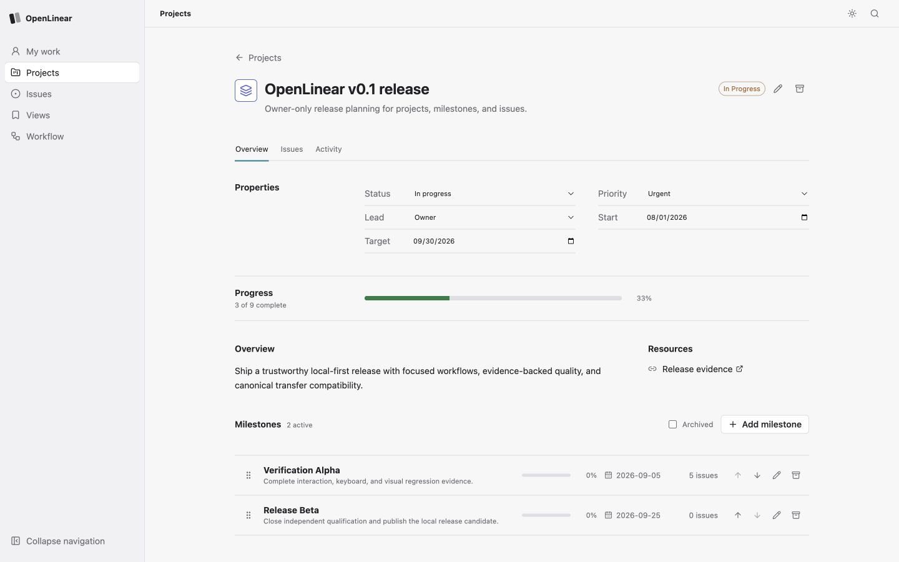

# OpenLinear

OpenLinear is a free, functional, local-first project management tool for
planning projects, breaking work into milestones and issues, and reviewing
progress every day. It runs on your computer, keeps durable data in a local
SQLite database, and is designed for a focused single-owner workflow.

This repository is a `v0.1.0` release candidate licensed under
`AGPL-3.0-only`. The sections below cover the user experience, local setup,
and the current product boundary.

## Daily work with OpenLinear

Use OpenLinear as a repeatable daily loop:

1. **Set the outcome.** Create a project, give it a target date, and write a
   short overview so the purpose is visible before work starts.

   

2. **Plan the checkpoints.** Add milestones for meaningful checkpoints, set
   dates, and watch completion progress as issues move through the workflow.

   

3. **Turn work into issues.** Capture one outcome per issue, then add status,
   priority, owner, labels, project, milestone, rich-text details, relations,
   and comments. Use the issue detail view to keep the context next to the
   work.

   

4. **Review and update.** Start the day from the issue list or a saved view,
   filter to the work that matters, update status as work progresses, and use
   the board or list layout for the level of detail you need. On a phone, the
   same issue properties remain available in a compact layout.

   

5. **Keep recurring views.** Save useful combinations of filters, grouping,
   layout, density, and visible properties so the next review starts from a
   known working view instead of rebuilding the query.

   

## Current product status

### Implemented

- Project creation, editing, ordering, progress, archive, restore, and purge.
- Milestone creation, editing, dates, ordering, issue linkage, progress,
  archive, restore, and purge.
- Issue creation and editing with status, priority, labels, projects,
  milestones, parent/child issues, relations, comments, rich text, archive,
  restore, purge, bulk actions, and activity history.
- List and board views, saved views, filtering, grouping, compact density,
  property configuration, search, recents, and URL state.
- Global and contextual keyboard commands, responsive layouts,
  Light/Dark/System themes, and mobile project/milestone workflows.
- Local SQLite durability, backups, canonical export/import, revision
  conflicts, restart recovery, local-only network boundaries, and the
  structured operator CLI.

### Not implemented yet

- Multiple users, invitations, permissions between users, or multiple
  workspaces and teams.
- Hosted accounts, cloud sync, email, external identity, or a remote service.
- Server-side collaboration, background jobs, webhooks, native mobile apps,
  or a hosted deployment.
- Docker, PostgreSQL, or a remote database. The supported runtime is local
  Node.js plus SQLite.
- Public contribution intake and final production release publication.

## Run locally

OpenLinear requires Node.js `24.18.0` and npm `11.16.0` (the supported Node
range is `>=24 <25`; `.nvmrc` is included). Install the locked workspace once:

```sh
npm ci
npm run build
```

Start the complete application with one command:

```sh
npm start
```

Open `http://127.0.0.1:4174`. The one Node process serves the built React application and `/api`, binds only to loopback, creates the sole owner and internal workspace/team/status metadata on first use, and stores all durable state in one SQLite file. It needs no setup account, database server, container runtime, external identity, credential, or outbound runtime request. If the default port is occupied, use `OPENLINEAR_PORT=4304 npm start`.

The default data locations are:

| Platform | Data directory |
| --- | --- |
| macOS | `~/Library/Application Support/OpenLinear` |
| Linux | `${XDG_DATA_HOME:-~/.local/share}/openlinear` |
| Windows | `%LOCALAPPDATA%\OpenLinear` |

Each directory contains `openlinear.sqlite3` and `backups/`. The single-writer database uses SQLite rollback journaling with `FULL` synchronous durability, so no WAL or shared-memory sidecar persists while the app is idle or after it stops. A temporary `-journal` file may exist only during an active transaction or crash recovery and must never be deleted manually.

## Environment setup

The application works without an environment file. To use explicit local
overrides, copy the example and edit only the values you need:

```sh
cp .env.example .env
set -a
. ./.env
set +a
npm start
```

The runtime does not require or implicitly load `.env`. Export the variables in
your shell or process manager before starting. `.env` is ignored by Git; never
put tokens, passwords, real user data, or credentials in `.env.example` or
source control.

POSIX shell:

```sh
set -a
. ./.env
set +a
npm start
```

PowerShell:

```powershell
$env:OPENLINEAR_DATA_DIR = "$HOME\\OpenLinear-data"
$env:OPENLINEAR_PORT = "4304"
npm start
```

| Variable | Default | Purpose |
| --- | --- | --- |
| `OPENLINEAR_DATA_DIR` | Platform data directory | Directory containing `openlinear.sqlite3` and `backups/`. |
| `OPENLINEAR_PORT` | `4174` | Loopback HTTP port, from 1 through 65535. |
| `OPENLINEAR_HOST` | `127.0.0.1` | Must be `127.0.0.1` or `::1`; remote binds fail closed. |
| `OPENLINEAR_SESSION_TTL_SECONDS` | `43200` | Process-memory session lifetime, from 300 through 86400 seconds. |
| `OPENLINEAR_BUILD_ID` | `development` | Optional label stored in canonical transfer metadata. |
| `XDG_DATA_HOME` | `~/.local/share` on Linux | Parent used when `OPENLINEAR_DATA_DIR` is unset. |
| `LOCALAPPDATA` | `~/AppData/Local` on Windows | Parent used when `OPENLINEAR_DATA_DIR` is unset. |

For a disposable checkout, keep data outside the repository:

```sh
OPENLINEAR_DATA_DIR=/tmp/openlinear-data OPENLINEAR_PORT=4304 npm start
```

The browser session is process-memory only. Restarting the process preserves application data and automatically renews the local session. Host, Origin, JSON content type, SameSite, HttpOnly, and per-tab CSRF checks protect state-changing requests.

## Develop and verify

```sh
npm run typecheck
npm test
npm run build
```

Use two terminals for split development:

```sh
# terminal 1
npm run dev:api

# terminal 2
npm run dev:web
```

Open `http://127.0.0.1:5173`. Vite proxies `/api` and `/health` to the API's
loopback port `4174`. Build the web application before testing the combined
production process.

## Repository layout

```text
apps/api/               Fastify HTTP boundary, session checks, static host
apps/web/               React/Vite application and interaction modules
packages/contracts/     TypeBox API and transfer contracts
packages/db/            SQLite schema, repositories, backup, import/export
packages/domain/        Pure domain rules and error semantics
packages/test-fixtures/ Deterministic data and test helpers
packages/ui/            Shared UI entry point and design tokens
packages/config/        Shared TypeScript configuration
ops/cli/                Local health, backup, export/import, and restore CLI
scripts/                Build, release, provenance, fixture, and audit tooling
docs/                   Architecture, configuration, operations, and evidence
pmo/                    Product intent, research, requirements, and roadmap
```

Keep dependency direction flowing from domain and contracts into the database,
API, operator, and web layers. Do not put database or HTTP logic in
`packages/domain`, and do not make the web application the source of truth for
durable state.

## Backup and transfer

The local operator defaults to the same platform data directory:

```sh
npm run operator -- paths
npm run operator -- health
npm run operator -- backup
npm run operator -- export --output ./workspace.json
```

Canonical workspace import, explicit scope selection, online backup, verification, and restore are documented in the [local recovery runbook](./docs/operations/recovery.md). Exports and backups can contain private workspace content; generated local copies should remain outside source control.

Maintainer planning, research, requirements, and implementation notes live in
the [PMO index](./pmo/index.md). Historical planning artifacts are retained for
development context and are not supported v0.1 runtime instructions.

## Documentation map

- [Documentation index](./docs/README.md)
- [Architecture](./docs/architecture.md)
- [Configuration reference](./docs/configuration.md)
- [Implementation status](./docs/status.md)
- [Recovery and transfer runbook](./docs/operations/recovery.md)
- [Contribution policy](./CONTRIBUTING.md)
- [Security policy](./SECURITY.md)
- [Third-party notices](./THIRD_PARTY_NOTICES.md)

## License

OpenLinear is licensed under `AGPL-3.0-only`; see [LICENSE](./LICENSE). Review
[THIRD_PARTY_NOTICES.md](./THIRD_PARTY_NOTICES.md) before redistributing a
build with additional assets or dependencies.
