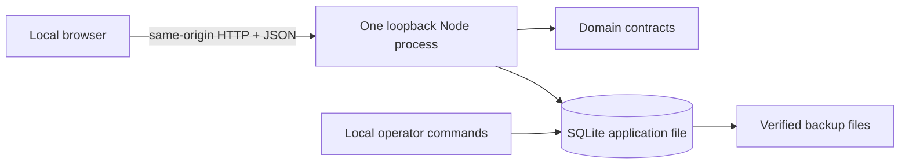

# Architecture

## Decision summary

Adopt a TypeScript npm-workspace monorepo with a React web client, a Fastify service, shared domain packages, and one embedded SQLite application file. The supported v0.1 topology is one Node 24 process bound to loopback that serves both the built web application and `/api`. Use explicit REST mutation contracts, optimistic revisions, a direct activity log, bounded scan search, and in-process change hints. Defer containers, PostgreSQL, OIDC, remote access, multi-user accounts, queues, object storage, separate search, durable outbox delivery, native shells, and multi-instance design.

`CT-79` supersedes the original Docker/PostgreSQL choice after the maintainer narrowed v0.1 to personal local use. The prior implementation remains a temporary canonical-export source until `CT-80` proves a non-destructive migration.

## Repository topology

```text
apps/
  web/              React, Vite, routing, query cache, interaction surfaces
  api/              Fastify routes, local-origin boundary, static web serving
packages/
  domain/           Pure entities, policies, commands, errors, revisions
  db/               node:sqlite adapter, migrations, repositories, transfer
  contracts/        Versioned request/response schemas and canonical export
  ui/               Tokens, accessible primitives, dense layout components
  test-fixtures/    Synthetic deterministic personal datasets and builders
ops/
  cli/               Local doctor, export, import, backup, restore, migration
```

Use npm workspaces and one lockfile. Applications depend inward on packages; `domain` has no framework or database dependency. UI components do not access storage directly. A small project-owned adapter contains every `node:sqlite` call so the release-candidate Node patch can be pinned or the driver replaced without changing domain contracts.

## Runtime topology



The process binds only `127.0.0.1` and `::1`, serves web assets and API routes, opens one SQLite connection, and serializes writes. Remote bind configuration fails closed. No external identity provider, proxy, database server, container runtime, or paid service is required or supported.

## Selected technologies

| Concern | Selection | Reason / reversal |
|---|---|---|
| Web | React + TypeScript + Vite | Preserves the accepted interaction surface and explicit client boundary |
| Routing/data | Existing URL state and query-cache contracts | Preserves direct links and list/detail state without changing product behavior |
| UI primitives | Lucide icons, established editor stack, project CSS tokens | Accessible behavior without adopting proprietary assets |
| Dense rendering | CSS grid, semantic structures, measured virtualization | Stable geometry; virtualization remains a UI concern, not a database-scale promise |
| Service | Fastify + TypeBox/JSON Schema contracts | Reuses validated routes and serves the built app from one process |
| Data | Node 24 `node:sqlite` + project-owned prepared statements and SQL migrations | One file, no server/native package, transactions, foreign keys, defensive mode, and online backup |
| Local access | Loopback bind, strict Host/Origin, ephemeral same-origin session, CSRF | Protects the local HTTP surface without accounts or persistent sessions |
| Events | Mutation response plus in-process change hint and bounded refetch | Supports multiple tabs without an outbox or distributed replay |
| Testing | Vitest, Playwright, axe-core, in-memory/on-disk SQLite fixtures | Unit, storage, security, restart, browser, visual, import, and recovery evidence |

Node 24 is pinned because `node:sqlite` is release-candidate stability. A future driver change stays behind the storage adapter. Runtime extensions are disabled.

## Supported scale

The v0.1 acceptance fixture contains no more than 10,000 issues, 1,000 projects, 2,000 milestones, and 50,000 combined comments, relations, and activity entries. There is one active owner and one writer. These values define measured support, not destructive quotas. Larger files open when valid, but their performance is not claimed.

## Domain and persistence

Every mutable aggregate retains a stable ID, integer `revision`, created/updated timestamps, and nullable archive metadata. Internal workspace and team IDs remain constant metadata for identifiers and canonical transfer; no membership or role table is required by the supported runtime.

Core storage covers application metadata, owner profile, workflow statuses, projects, project resources, milestones, issues, issue resources, labels, issue-label links, issue relations, comments, personal saved views, activity entries, and bounded idempotency records. Rich text stores versioned JSON text validated by the domain layer. Project and milestone progress is derived, not persisted. Relation inverses and status retirement commit in one transaction.

Initial indexes are limited to primary keys, uniqueness, and direct relationship lookup. No FTS, GIN, materialized progress, or speculative sort/filter index is included. CT-80 may add one focused index only when an accepted workload query misses its budget and evidence shows the index fixes that query.

## Request and conflict contract

- Reads return stable IDs and revisions.
- Updates require the expected revision.
- A stale revision returns `409 conflict` and authoritative state; the service never merges silently.
- Bounded idempotency records protect retryable creates and destructive commands.
- A mutation and its activity entry commit in one short `BEGIN IMMEDIATE` transaction.
- Errors use stable codes and safe messages; private content, tokens, and personal paths do not enter logs.

## Local security boundary

The supported threat model is local, not multi-tenant. The service:

- rejects non-loopback listeners and unexpected Host headers;
- accepts browser state changes only from its exact origin with JSON and CSRF validation;
- uses an ephemeral `HttpOnly`, `SameSite=Strict` process session without a session table;
- applies restrictive data and backup permissions where supported;
- rejects unsafe, escaping, or symlinked operator paths;
- validates all route IDs and canonical import fields; and
- runs with no outbound runtime request.

The release does not claim protection from a compromised OS account or an attacker with direct file access. Multi-user, remote, and shared-filesystem operation require new Discovery.

Historical two-workspace/RLS tests remain evidence about the retired PostgreSQL build. The current adversarial suite instead covers Host/Origin/CSRF, remote bind rejection, path traversal/symlinks, corrupt imports, stale writes, restart, backup promotion, and single-scope selection.

## Local session and bootstrap

There is no v0.1 login or OIDC. First start creates the sole owner profile, internal workspace/team IDs, and default statuses in one transaction. The server generates a process-local browser session and CSRF value; a restart creates a new browser session without changing product data. Multiple tabs share persisted state and refetch after change hints.

## Search and views

Search performs a bounded case-insensitive scan over issue identifier, title, description, and labels plus project name and summary. TypeScript applies deterministic exact/prefix/contains ranking and returns a bounded result set. Filters use the existing versioned AST, compile to simple parameterized predicates where useful, and may finish bounded filtering/sorting in process. Invalid state remains visible and never broadens silently. Saved views are personal only.

## Operations and recovery

The supported release exposes one start command plus `doctor`, `export`, `import`, `backup`, `backup verify`, `restore`, and `migrate`. The data path defaults to the platform user-data directory and can be overridden only by an explicit local/test flag.

SQLite opens with foreign keys and defensive mode enabled plus a bounded busy timeout. The single connection uses `DELETE` rollback journaling with `FULL` synchronous durability, selected after CT-84 reproduced persistent WAL/SHM residue on the documented npm interrupt path. This keeps the idle and cleanly stopped footprint to the main database file; a transient rollback journal remains SQLite-owned during a write or crash recovery. Write transactions are short. `PRAGMA user_version` owns ordered schema migration. Startup never performs an unverified destructive migration.

Online backup writes a new timestamped database, verifies `integrity_check`, canonical digest, counts, and a manifest hash. Restore verifies a temporary database and atomically promotes it only after every check passes. A failed import, migration, backup, or restore leaves the last known-good file selected.

## PostgreSQL transition

The current PostgreSQL build remains read-only transition tooling until it emits the last canonical fixture. `CT-80` imports one explicit workspace/team into a temporary SQLite file and proves stable IDs, timestamps, order, relations, rich text, counts, and canonical digest. Multi-scope input without explicit selection fails closed. There is no dual write, direct binary conversion, or destructive source migration.

## Quality architecture

Unit tests cover domain invariants and filter normalization. Storage tests run SQLite in memory and on disk with real migrations, interruption, restart, canonical transfer, corruption, and recovery. Security tests cover the local-origin and filesystem boundary. Performance tests use the accepted personal workload and record event-loop blocking as well as query time. Playwright covers canonical workflows, keyboard behavior, responsive viewports, and screenshots. Manual assistive-technology and UAT evidence remain independent requirements.

## Decision records

`CT-79` owns this architecture choice. `CT-80` records schema, adapter, canonical migration, query plans, and initial storage evidence; CT-84 supersedes its initial WAL choice with the interruption-tested rollback-journal policy. `CT-81` records one-process serving, data paths, local-origin controls, dependency/runtime retirement, and start commands. `CT-82` independently records clean local start, upgrade, backup, restore, rollback, offline operation, and accepted-scale evidence. A future request for remote or collaborative operation returns to Discovery.
