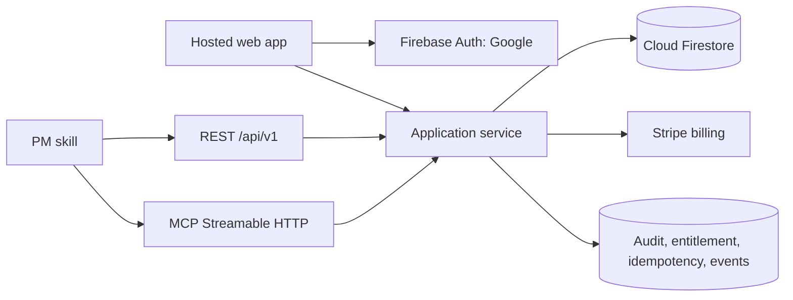

# Architecture decision

## Logical architecture

Firebase Hosting serves the existing Vite SPA from its static production bundle. Firebase Auth establishes Google identity. Firebase Hosting rewrites `/api/**`, `/mcp`, and OAuth endpoints to a trusted application service implemented on Cloud Run/Functions, which owns all privileged mutations, billing, invitation secrets, external tokens, REST, and MCP. Firestore is the hosted authority. The local SQLite authority is not synchronized live. This is the accepted IR-202 framework refinement: official App Hosting guarantees Next.js and Angular adapters, not this Vite workspace, while Firebase Hosting directly supports static HTML/CSS/JavaScript assets and dynamic rewrites.

## Data partitions

Every business record carries `workspace_id`. Publicly client-readable collections are limited to authorized workspace data: projects, milestones, issues, comments, members, and safe activity views. Trusted-only collections contain invite digests, API token hashes, idempotency keys, Stripe customer/subscription references, entitlement transitions, billing reconciliation, abuse signals, and cost telemetry.

Stable IDs are opaque. Issue mutations require an expected revision. Comments retain immutable author UID, created timestamp, revision, and optional deleted timestamp. Membership transitions are explicit: `pending` invitation, `active` membership, and `removed`; a removed member loses access immediately.

## Authorization

Browser requests present Firebase ID tokens. Firestore rules and server handlers both require authenticated UID, exact workspace, active membership, and allowed role. Rules deny by default. Admin SDK use never bypasses application authorization checks merely because the SDK can.

REST clients use scoped personal tokens created by an owner. Store only a token hash, prefix, scopes, workspace ID, creator UID, expiry, last-used timestamp, audience, and revocation timestamp. Remote MCP uses an OAuth 2.1 resource-server flow with Protected Resource Metadata, authorization-server/OIDC discovery, PKCE, explicit resource/audience binding, short-lived access tokens, and per-client/workspace/scope consent after Firebase/Google authentication. REST and MCP resolve the same principal and permission decision. Token creation and billing purchase are deliberately absent from MCP, and MCP tokens are never passed through to Firebase, Stripe, or another service. This is the accepted T-SECURITY-MCP refinement; PAT-only remote MCP is not releaseable.

## API and MCP contracts

`/api/v1` is documented with OpenAPI 3.1.1. Collection endpoints use opaque cursor pagination. Mutations accept `Idempotency-Key` and `If-Match`/expected revision as appropriate. Errors use stable machine codes plus safe remediation text.

The MCP endpoint implements the accepted enhanced Streamable HTTP revision `2026-07-28` and the standard `2025-06-18` lifecycle used by current remote clients. Both profiles use a single POST endpoint, no GET event stream, no protocol session identifier, and request-scoped JSON or SSE responses. The standard profile supports `initialize`, `notifications/initialized`, `ping`, tool discovery and invocation, plus empty resource, resource-template, and prompt discovery. It binds the authorized OAuth workspace server-side and omits `workspaceId` from client-facing tool schemas. The enhanced profile preserves explicit workspace input and the existing mirrored headers. Both enforce capability metadata, audience-bound OAuth, current membership and scope checks, JSON-RPC media, bounded bodies, revision/idempotency semantics, and audit records. REST and MCP call the same application service; neither reimplements authorization or entity rules. Operational rate limits, abuse budgets, and deployed-runtime telemetry remain CT-141.

## Billing and entitlement

Trusted bootstrap writes trial eligibility once per owner UID. Server time defines trial start and end. Stripe Checkout starts monthly or annual subscription for the current active-seat quantity. Signature-verified webhooks update subscription and entitlement through idempotent transactions. Client-supplied price, quantity, trial state, or entitlement is ignored.

An entitlement evaluator returns `trial_pro`, `paid_pro`, or `free`. A downgrade never deletes data. Mutation policy uses entitlement plus membership; the stored subscription document is not itself authorization.

## Reliability, cost, and observability

Use emulator-backed rules tests, event and audit schema versions, structured redacted logs, rate limits per principal/workspace/IP, Firebase budget alerts, Firestore query/index budgets, and cost-per-active-seat reporting. Failed webhooks retry safely. All irreversible owner actions keep the existing explicit-confirmation posture.

## Migration boundary

Hosted schema starts new. Local export remains a portability source, but automated local-to-hosted import is not included. Existing local records are never silently uploaded. Any future sync/import requires its own conflict, consent, and migration contract.
